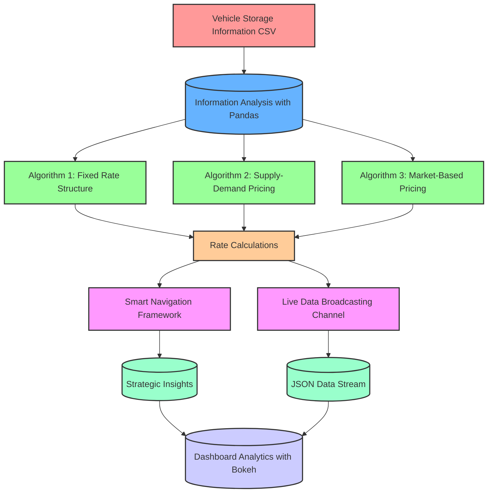
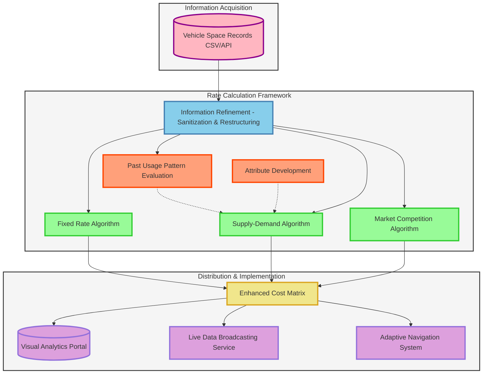

# dpful
Dynamic Pricing for Urban Parking Lots
# Dynamic Pricing for Urban Parking Lots

This repository contains the complete solution to the **Summer Analytics 2025 Capstone Project** hosted by Consulting & Analytics Club × Pathway.

##  Project Objective

To simulate real-time **dynamic pricing** for urban parking lots based on live occupancy, traffic, vehicle type, and competitive pricing logic using:

* Python (Numpy, Pandas)
* Bokeh (for real-time visualization)
* Modular design (split into `src/` and `notebooks/`)

##  Folder Structure

```
urban-parking-pricing/
├── data/                      # Dataset
│   └── dataset.csv
├── notebooks/                # Notebook for EDA and simulation
│   └── final_notebook.ipynb
├── src/                      # All reusable Python modules
│   └── pricing_models.py
├── visualizations/           # Bokeh visual helper
│   └── bokeh_charts.py
├── outputs/                  # Results and dashboards
│   ├── simulated_parking_prices.csv
│   └── final_dashboard.html
├── report/                   # Final Report
│   └── final_report.pdf
├── README.md
└── requirements.txt
```
## system architecture
# Parking System Architecture Diagrams

## Diagram 1: Vehicle Storage Data Flow System




## Diagram 2: Vehicle Management System Architecture




## System Architecture Overview

Both diagrams represent a comprehensive parking management system with the following key features:

### Data Flow Process
1. **Input Layer**: Vehicle parking data ingestion from CSV files or APIs
2. **Processing Layer**: Data cleaning, transformation, and feature engineering
3. **Modeling Layer**: Multiple pricing algorithms working in parallel
4. **Output Layer**: Consolidated pricing results and recommendations
5. **Deployment Layer**: Various services for end-user consumption

### Key Technologies
- **Pandas**: Data processing and analysis
- **Bokeh**: Interactive data visualization
- **JSON**: Data interchange format
- **Real-time APIs**: Live data streaming
- **Machine Learning**: Pattern recognition and prediction

### Business Applications
- Dynamic pricing optimization
- Real-time parking availability
- Strategic business insights
- Intelligent routing recommendations
- Competitive market analysis##  Model Overview

### Model 1: Linear Pricing

```
Price += alpha * (occupancy / capacity)
```

### Model 2: Demand-Based

Uses a custom function:

```
Demand = α*(occ/cap) + β*queue - γ*traffic + δ*special + ε*vehicle_type
```

Then:

```
Price = Base * (1 + λ * NormalizedDemand)
```

### Model 3: Competitive Pricing

* Uses **haversine distance** between lots
* Adjusts based on nearby lot prices

---

##  Visualization

* Implemented using Bokeh
* Real-time trends of Price and Occupancy
* Supports comparison of 4 lots simultaneously

##  How to Run

```bash
pip install -r requirements.txt
jupyter notebook notebooks/final_notebook.ipynb
```

##  Dataset

The dataset contains real-time logs from 14 lots over 73 days sampled every 30 mins.

* Columns: Occupancy, Capacity, QueueLength, VehicleType, TrafficLevel, SpecialDay, etc.

##  Future Work

* Streamlit dashboard
* Integration with Pathway’s stream ingestion
* Real-time rerouting engine

##  Author

*  A.Laxmanreddy IIserTVM
* Guided by Summer Analytics 2025, CAC IITG
